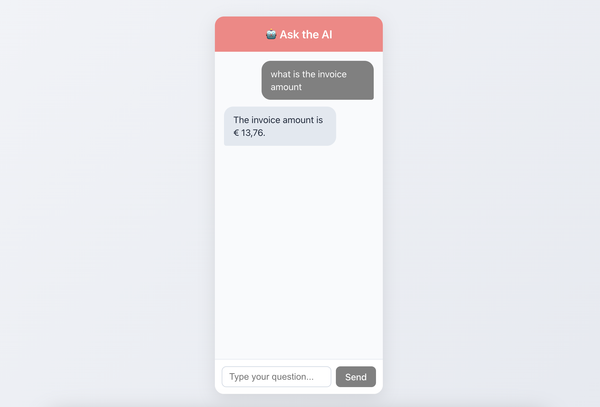
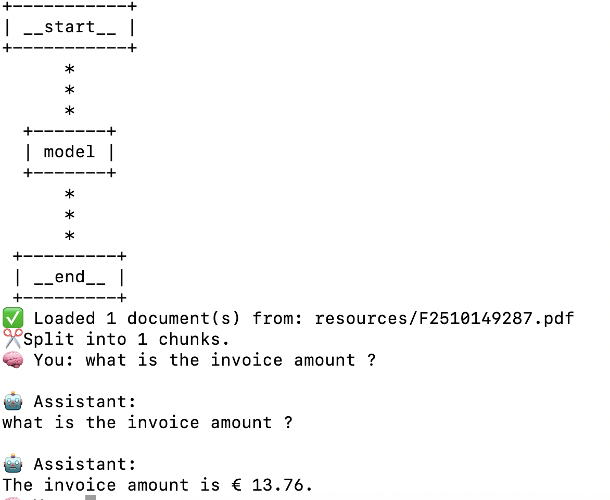
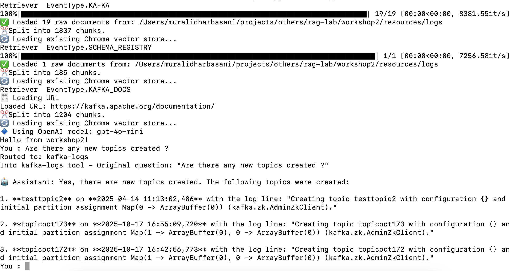

Workshops based on RAG, LangChain, Ollama, and FAISS embeddings, chroma vector store.

## Workshop 1
Basig RAG with LangChain, LangGraph

With UI  

With CLI  

## Workshop 2
Agentic RAG

Classify user's kafka related query and invoke LLM

With CLI  
